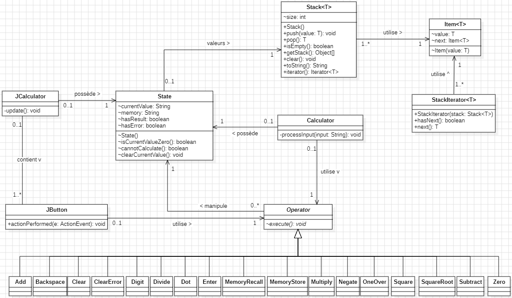

# POO - Labo 7

- Groupe : L07GrK
- Etudiants : Calum Quinn, Dylan Ramos
- Date de dernière modification : 28.11.2023

## Diagramme de classes

## Choix de conception

### Classe `Operator`

Conformément au diagramme de classes fourni, nous avons ajouté un attribut `state` à la classe `Operator` afin de
connaître l'état de la calculatrice à chaque opération. Pour chaque opération, nous avons créé une classe qui hérite de
la classe `Operator` et qui permet de définir le comportement de l'opération.

### Classe `State`

La classe `State` représente l'état actuel de la calculatrice. Elle contient la stack, la valeur courrante, la valeur en
mémoire ainsi que deux variables booléennes qui permettent de savoir si l'opération précédente donnait un résultat ou
s'il y a eu une erreur. À noter que nous travaillons avec des `String` pour la stack et la valeur courrante afin de
faciliter la gestion de l'affichage. D'autre part, la classe ainsi que ses attributs et méthodes ont une visibilité
package pour permettre aux classes du package `calculator` d'y accéder. Cela a du sens, car la classe `State` est
le cœur de la calculatrice et il est donc logique que les classes du package `calculator` puissent y accéder.

## Tests effectués

- Exemple fourni au point 2
- Opération sur une stack vide : rien ne se passe
- Opération sur une stack non vide : l'opération est effectuée sur la valeur courante et l'élément en haut de la stack
- One Over : la valeur courante est inversée, si elle est égale à zéro, un message d'erreur s'affiche
- Square : la valeur courante est élevée au carré
- Square root d'un nombre positif : la racine carrée est calculée
- Square root d'un nombre négatif : un message d'erreur s'affiche
- Memory Store : la valeur courante est stockée dans la mémoire et la valeur courante est remise à zéro
- Memory Recall : la valeur en mémoire devient la valeur courante et si la valeur précédente était un résultat, celle-ci est ajoutée à la stack
- Clear : la stack est vidée et la valeur courante est remise à zéro
- Clear Error : la valeur courante est remise à zéro
- Backspace : le dernier chiffre de la valeur courante est supprimé et rien ne se passe quand il y a rien d'affiché
- Point : un point est ajouté à la valeur courante, s'il y en a déjà un, rien ne se passe
- Signe : le signe de la valeur courante est inversée
- Divide : si la valeur actuellement affichée est un 0, un message d'erreur s'affiche
- Appui sur un chiffre après une opération : la valeur courante est remplacée par le chiffre et le résultat de l'opération précédente est ajouté à la stack
- Appui sur Ent : la valeur courante est ajoutée à la stack sauf si elle vaut 0